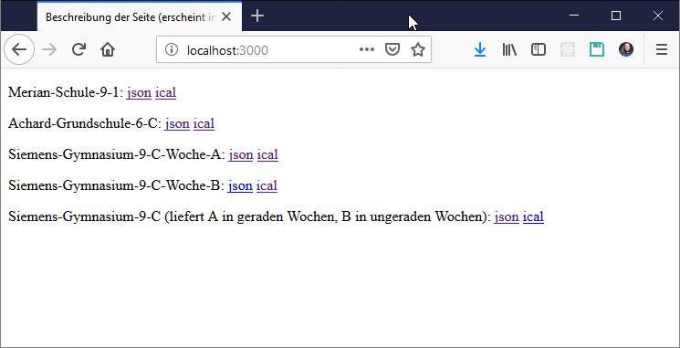
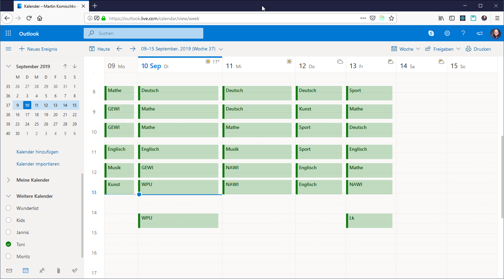
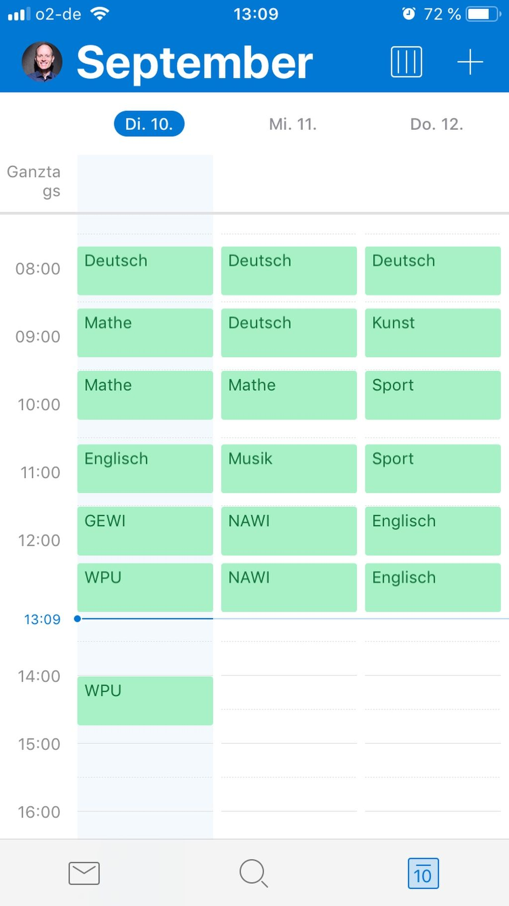

# Node JS app to provide the school timetables as iCAL

The raw data is stored in JSON files. The NodeJS app is using Express to serve iCal files out of this.

The iCal is created so that only the current week will be filled with the schedule.
Hence if you browse to a different week in your calendar you will not see any schedule.

You can subscribe to the iCal feed in your favorite calendar app to integrate the timeschedule.

The summary page of all available timeschedules:

Web | iOS
--- | ---
 | 

# Run the web server

`node app/index.js`

call

`http://localhost:3000/`

in your favorite browser

# Test the application code

Run `npm test` to execute all tests.

[1]: https://semaphoreci.com/community/tutorials/getting-started-with-node-js-and-mocha
[2]: https://www.npmjs.com/package/ical-generator

